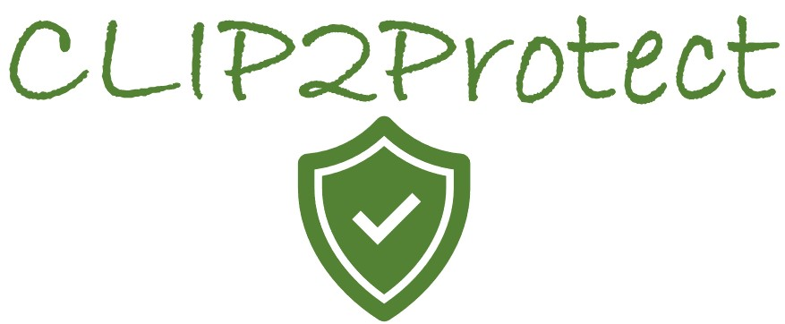
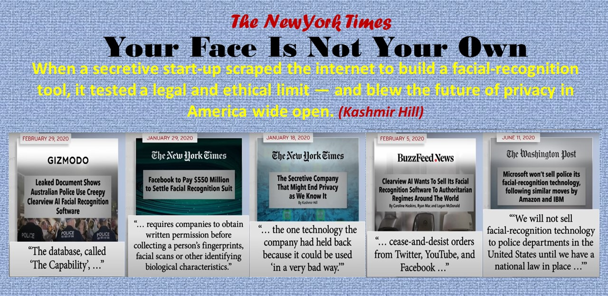
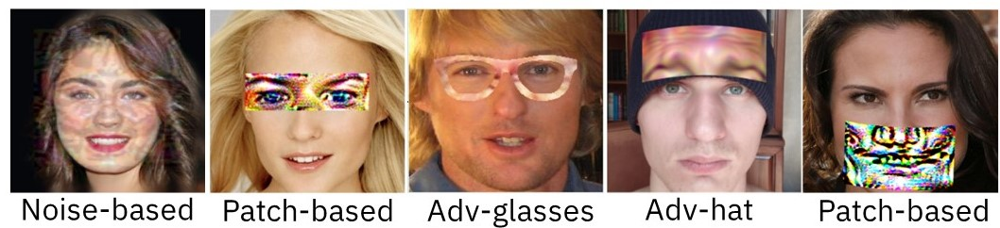
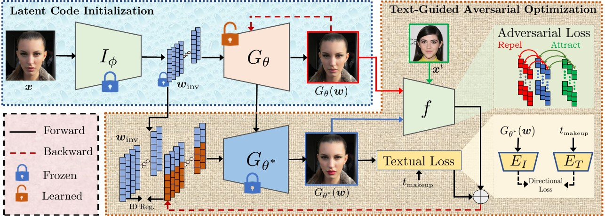

<p align="center">
  

  <h2 align="center"><strong>CLIP2Protect: Protecting Facial Privacy using Text-Guided Makeup via Adversarial Latent Search [CVPR 2023]</strong></h2>

  <p align="center">
    <a href="https://fahadshamshad.github.io"><strong> Fahad Shamshad</strong></a>,
    <a href="https://muzammal-naseer.netlify.app/"><strong> Muzammal Naseer</strong></a>,
    <a href="https://scholar.google.com/citations?user=2qx0RnEAAAAJ&hl=en"><strong> Karthik Nandakumar</strong></a>
    <br>
    <span style="font-size:4em; "><strong> MBZUAI, UAE</strong>.</span>
  </p>
</p>


<p align="center">
  <a href="https://openaccess.thecvf.com/content/CVPR2023/html/Shamshad_CLIP2Protect_Protecting_Facial_Privacy_Using_Text-Guided_Makeup_via_Adversarial_Latent_CVPR_2023_paper.html" target='_blank'>
    
  </a> 
  
  <a href="https://fahadshamshad.github.io/Clip2Protect/" target='_blank'>
    
  </a>

  <a href="https://www.youtube.com/watch?v=CUSVyvM_-6o" target='_blank'>
    
  </a>
</p>


##  Updates :loudspeaker:
- **Jun-19** : Code and demo release coming soon. Stay tuned!


## 🎯 Central Idea 🎯 
### We all love sharing photos online, but do you know big companies and even governments can use sneaky 🕵️‍♂️ face recognition software to track us? Our research takes this challenge head-on with a simple and creative idea 🌟: using carefully crafted makeup 💄 to outsmart the tracking software. The cherry on top? We're using everyday, easy-to-understand language 🗣️ to guide the makeup application, giving users much more flexibility! Our approach keeps your photos safe 🛡️ from unwanted trackers without making you look weird or having bizarre patches on your face, issues commonly seen with previous solutions.

## Motivation :muscle: :fire: 
- Malicious black-box Face recognition systems pose a serious threat to personal security/privacy of **5 billions people** using social media.
- Unauthorized entities can use FR systems to **track user activities** by scraping face images from social media platforms.
- There is an urgent demand for effective privacy preservation methods.

<p align="center">
  

## Limitation of existing works :warning: 
 - Recent noise-constrained adversarial attacks to conceal user identity results in artefacts. 
 - Patch-based privacy approaches provide low privacy protection and their large visible pattern compromises naturalness.
 - The closely related AMT-GAN (CVPR 2022) needs a reference image for makeup style definition, which could affect practicality.

<p align="center">
  


## Pipeline

**CLIP2Protect** comprises two stages. 
- **The latent code initialization stage** reconstructs the given face image in the latent space by fine-tuning the generative model.
- **The text-guided adversarial optimization stage** utilizes user-defined makeup text prompts and identity-preserving regularization to guide the search for adversarial codes within the latent space to effectively protect the facial privacy.

<p align="center">
  
</p>


If you're using CLIP2Protect in your research or applications, please cite using this BibTeX:
```bibtex
@inproceedings{shamshad2023clip2protect,
  title={CLIP2Protect: Protecting Facial Privacy Using Text-Guided Makeup via Adversarial Latent Search},
  author={Shamshad, Fahad and Naseer, Muzammal and Nandakumar, Karthik},
  booktitle={Proceedings of the IEEE/CVF Conference on Computer Vision and Pattern Recognition},
  pages={20595--20605},
  year={2023}
  }
```

