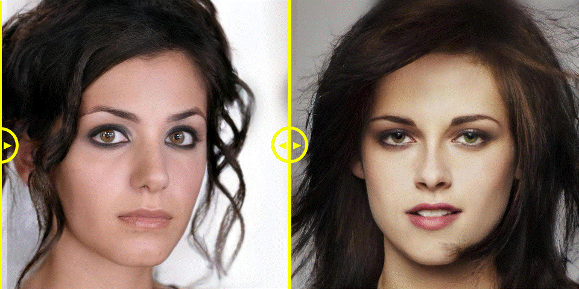

# Table of Contents

- [Updates](#updates-loudspeaker)
- [Central Idea](#central-idea)
- [Motivation](#motivation-muscle-fire)
- [Limitation of existing works](#limitation-of-existing-works-warning)
- [Pipeline](#pipeline)
- [Instructions for Code usage](#instructions-for-code-usage)
- [Citation](#citation)


<p align="center">
  

  <h2 align="center"><strong>CLIP2Protect: Protecting Facial Privacy using Text-Guided Makeup via Adversarial Latent Search [CVPR 2023]</strong></h2>

  <p align="center">
    <a href="https://fahadshamshad.github.io"><strong> Fahad Shamshad</strong></a>,
    <a href="https://muzammal-naseer.netlify.app/"><strong> Muzammal Naseer</strong></a>,
    <a href="https://scholar.google.com/citations?user=2qx0RnEAAAAJ&hl=en"><strong> Karthik Nandakumar</strong></a>
    <br>
    <span style="font-size:4em; "><strong> MBZUAI, UAE</strong>.</span>
  </p>
</p>


<p align="center">
  <a href="https://openaccess.thecvf.com/content/CVPR2023/html/Shamshad_CLIP2Protect_Protecting_Facial_Privacy_Using_Text-Guided_Makeup_via_Adversarial_Latent_CVPR_2023_paper.html" target='_blank'>
    
  </a> 
  
  <a href="https://fahadshamshad.github.io/Clip2Protect/" target='_blank'>
    
  </a>

  <a href="https://www.youtube.com/watch?v=CUSVyvM_-6o" target='_blank'>
    
  </a>
</p>


<p align="center">
  
</p>
  
<p align="center">
  


##  Updates :loudspeaker:
- **July-19** : Code released.
- **June-19** : Code and demo release coming soon. Stay tuned!


<a name="central-idea"></a>
## 🎯 Central Idea 🎯 
### We all love sharing photos online, but do you know big companies and even governments can use sneaky 🕵️‍♂️ face recognition software to track us? Our research takes this challenge head-on with a simple and creative idea 🌟: using carefully crafted makeup 💄 to outsmart the tracking software. The cherry on top? We're using everyday, easy-to-understand language 🗣️ to guide the makeup application, giving users much more flexibility! Our approach keeps your photos safe 🛡️ from unwanted trackers without making you look weird or having bizarre patches on your face, issues commonly seen with previous solutions.

<a name="motivation-muscle-fire"></a>
## Motivation :muscle: :fire: 
- Malicious black-box Face recognition systems pose a serious threat to personal security/privacy of **5 billions people** using social media.
- Unauthorized entities can use FR systems to **track user activities** by scraping face images from social media platforms.
- There is an urgent demand for effective privacy preservation methods.

<p align="center">
  

## Limitation of existing works :warning: 
 - Recent noise-based facial privacy protection approaches result in artefacts. 
 - Patch-based privacy approaches provide low privacy protection and their large visible pattern compromises naturalness.

<p align="center">
  


## Pipeline

**CLIP2Protect** generates face images that look natural and real. **But here's the special part**: it also ensures a high level of privacy protection. This means you can keep sharing images without worrying about unwanted tracking. It consists of two stages. 
- **The latent code initialization stage** reconstructs the given face image in the latent space by fine-tuning the generative model.
- **The text-guided adversarial optimization stage** utilizes user-defined makeup text prompts and identity-preserving regularization to guide the search for adversarial codes within the latent space to effectively protect the facial privacy.

<p align="center">
  
</p>

<a name="instructions-for-code-usage"></a>
## Intructions for Code usage

### Setup

- **Get code**
```shell 
git clone https://github.com/fahadshamshad/Clip2Protect.git
```

- **Build environment**
```shell
cd Clip2Protect
# use anaconda to build environment 
conda create -n clip2protect python=3.8
conda activate clip2protect
# install packages
pip install -r requirements.txt
```

## Steps for Protecting Faces

1. Our solution relies on the [Rosinality](https://github.com/rosinality/stylegan2-pytorch/) PyTorch implementation of StyleGAN2.

2. **Download the pre-trained StyleGAN2 weights**: 
   - Download the pre-trained StyleGAN2 weights from [here](https://drive.google.com/file/d/1EM87UquaoQmk17Q8d5kYIAHqu0dkYqdT/view?usp=sharing).
   - Place the weights in the 'pretrained_models' folder.

3. **Download pretrained face recognition models and dataset instructions**:
   - To acquire pretrained face recognition models and dataset instructions, including target images, please refer to the AMT-GAN page [here](https://github.com/CGCL-codes/AMT-GAN).
   - Place the pretrained face recognition model in the `models` folder.

4. **Acquire latent codes**:
   - We assume the latent codes are available in the `latents.pt` file.
   - You can acquire the latent codes of the face images to be protected using the encoder4editing (e4e) method available [here](https://github.com/omertov/encoder4editing).

5. **Run the code**:
   - The core functionality is in `main.py`.
   - Provide the `latents.pt` file and the corresponding faces directory, named 'input_images'.
   - Generate the protected faces in the 'results' folder by running the following command:
     ```shell
     python main.py --data_dir input_images --latent_path latents.pt --protected_face_dir results
     ```

6. **Generator finetuning and adversarial optimization stages**:
   - The generator finetuning is implemented in `pivot_tuning.py`.
   - The adversarial optimization is implemented in `adversarial_optimization.py`.


## Citation 

If you're using CLIP2Protect in your research or applications, please cite using this BibTeX:
```bibtex
@inproceedings{shamshad2023clip2protect,
  title={CLIP2Protect: Protecting Facial Privacy Using Text-Guided Makeup via Adversarial Latent Search},
  author={Shamshad, Fahad and Naseer, Muzammal and Nandakumar, Karthik},
  booktitle={Proceedings of the IEEE/CVF Conference on Computer Vision and Pattern Recognition},
  pages={20595--20605},
  year={2023}
  }
```
